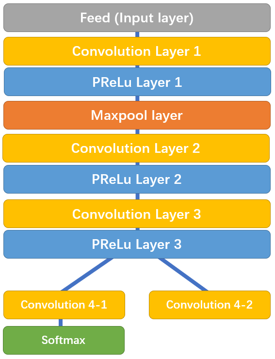
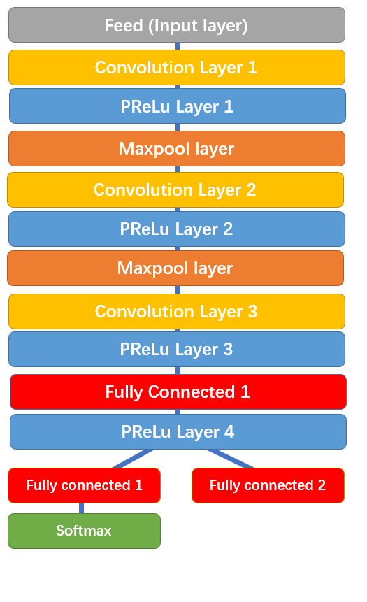

# Winning-DeepFake-Review
Line-by-line review of the prediction parto of the winning submission to the Facebook Kaggle Deep Fake detection competition.

Line by line review of the DeepFake Kaggle competition winner

## 0. Table of content

* [1. About the context of this study](#content)
* [2. About DeepFake competition](#competition)
  * [a. Context](#context)
  * [b. Links](#links)
  * [c. Scoring](#scoring)
* [3. Used network types](#network)
  * [a. EfficinetNet](#efficient)
  * [b. Multi Task Cascaded CNN (Facenet](#facenet)
    * [1. P-Net](#pnet)
    * [2. R-Net](#rnet)
    * [3. O-Net](#onet)
* [4. Techniques and transformations](#tricks)
  * [a. Dropout](#dropout)
  * [b. Average pooling 2D](#avgpool)
  * [c. Inter-cubic and Inter-area interpolations](#interpolations)
  * [Isotropic face transformation](#isotropic)
* [5. Other subsidiary considerations](#other)
* [6. Thanks](#thanks)
	
	
## 1. About the context of this study <a name="content">

This study is part of my training in Machine Learning.

I was asked to choose a Kaggle competition and to analyse the code of one of its winners.
I chose DeepFake Detection because it is a challenging quest, which warranty the presence of  very clever ways of thinking as well as established rules. Both are what I need and what I thrive with.

I wish I had more time to study it. As an individual worker on this subject, I put my attention on the prediction. I hope that I will, one day, take the time to understand as deeply the more challenging training part as I understood the prediction part.

## 2. About the DeepFake competition <a name="competition">

### a. Context  <a name="context">
  

Facebook granted to the winners a total of 1 million dollars. The goals was to design an algorightm which is able to detect whether a video is a deepfake.

Some troubles regarding a winning team who trained on a set of videos expanded by external sources like Youtube and Flickr occured, bu finally Selim Seferbekow won by a quite small margin, compared to the second who actually was a team.

### b. Links  <a name="links">

DeepFake Kaggle competition : https://www.kaggle.com/c/deepfake-detection-challenge/overview

Winning submissions's repository - from Selim Seferbekov : https://github.com/selimsef/dfdc_deepfake_challenge

### c. Scoring  <a name="scoring">

The score used for this competition was the log loss (often called cross-entropy loss). It's a metrics that needs to be minimized.

The log loss is the log of the likelihood function, which is basically the product of the predictions realizing for each observation. For example, it will be 0.9 * 0.3 = 0.27 if the first was correctly predicted with 0.9 confidence, and the second predicted the incorrect output with 0.7 confidence (therefore 0.3 confidence for the actual output). 

Here is its formula, for K classes and N samples:

By convention, we multiply it by -1 so that a higher (and closer to zero) score is better.

## 3. Used network types <a name="network">

### a. EfficientNet <a name="efficient">

A basic convolutional network is not designed with a fixed architecture in mind. This architecture might represent the most important hyperparameter. 

Changing this hyperparameter, which actually is multiple, means scaling through three different dimensions : 
- width: more parameter per convolution layer, mostly meaning more channels, makes the model more sensible to fine details, without compromising too much on the time perfomance.
- depth: more layers of convolution (and potentially other treatments) makes the model more able to capture complex features. But it also increase the likelihood of the gradient vanishing, and makes it more time intensive.
- resolution: more input features obviously means more details and better accuracy, but the quickly gets very prohibitive.

Efficient net is a convolution neural network where each of these dimensions has a factor (alpha, beta and gamma) which can be tuned ; its goals is to get the best combination to offer the best accuracy/time compromise to tune the actual parameters. A fourth parameter phi is necessary : the coumpound coefficient which indicate how much computational resources can be put into it.

To optimize the process of finding an efficient architecture, a mathematical relation between those parameters was found. Hence the EfficientNet.

EfficientNet is the main trained model used here to make the final predictions. It is given the extracted images of faces which were previously cropped and tranformed.

### b. Multi Task Cascaded CNN (Facenet) <a name="facenet">

It is a network that is composed of 3 separate networks : P-Net, R-Net and O-Net. Each of them have a specific task which work towards the goal of the whole network : localizing faces and facial landmarks. 

All three aim to do three tasks, but at different levels, thus the specificity of each of those sub-networks. Those tasks are face classification, regression of the facial boundaries (as rectangles, called bounding boxes) and facial landmarks (eyes, mouth, nose).

#### 1) P-Net : the Proposal Network  <a name="pnet">
	

	
The P-Net's goal is to detect faces and reduce the number of possible candidate areas. Its output feeds the next network.

#### 2) R-Net : the Refine Network  <a name="rnet">

	
The R-Net is better suited to confidently tell if the face candidates are really faces or not. It also grossly localizes the landmarks.

#### 3) O-Net : the Output Network  <a name="onet">

The O-Net describes the face in more details and focuses on tuning the position	of the bounding boxes and landmarks.

A MTCNN is used in this project, in an early stage of face detection. The author chose to not keep the landmatks at all to detect the fakeness of the faces. Instead, he invited us to keep the bounding boxes as cropped images from the original frames, and then feed it (after some transformation) to our EfficientNet.

## 4. Techniques and transformations  <a name="tricks">

### a. Dropout <a name="dropout">
	
Dropout is a technique, very easy to call in Deep Learning libraries, that simply turns off neurones chosen randomly. Those neurons can wake up in the next iteration.

This technique has only one purpose : to prevent overfitting, especially in fully connected neural networks which can produce very strong inter-dependance among themselves.

Usually, dropout is turned on (to turn off neurons, please remain with me) during backpropagation then turned off during the forward and prediction phases.

This technique will be applied to the EfficientNet in this case study.

### b. Average Pooling 2D <a name="avgpool">

This explanation will assume you know what a mask (or a kernel) of a convolution layer does.

Instead of adding the element-wise multiplication during a regular convolution, pooling will apply a different type of operation. Max function for maxpooling, min function for min pooling, average for average (or AVG) pooling.

This operation will be used between the EfficientNet and the FullyConnected Layer.

The 2D is just the well knows applicaion over a 2 dimensional matrix.

### c. Inter-cubic and Inter-area interpolations <a name="interpolations">
	
Interpolation can basically be explained as "guessing which information should be here".

When we resize an image, the number of pixels changes. As an exemple, going from a simple width to its double, we don't want a pixel to spread as four similar ones. We rather want to take into account the neighboring pixels to "guess" what is the intermediary features the new pixels should be have.

Inter-cubic, or bicubic, interpolation takes into account 16 neighboring pixel. It is one of the costliest method, but it gives very good results when the goal is to add to the size of the original image, which is the case chere it will be used here. Plus, the cost of this method is kind of negligeable in comparison of other ones in the global Deep Learning process.

A similar issue also occurs when reducing the size of a picture : which value should the pixel takes when it was previously "more than itself" ?

For shrinking the image size, Inter-area interpolation method will be used, as it seems to be a specific technique for this case. Unfortunately, I couldn't find more inforamations and this matter seems to be worth of a specific study.

### d. Isotropic face transformation <a name="isotropic">
	
As we have to pass rectangularly-edged data (aka tensors) to our efficientnet, and while it is very computationaly greedy, we don't want any waste by feeding empty space, especially when the solution to this issue also helps with other issues.

We want our ovular faces (cropped, thanks to the bounding boxes) to take as much of a rectangle as possible. This obviously induces a change in the proportion of the facial feature. To avoid any facial feature to be more altered than other, we have to make sure that the transformation is equally spared between all area.

That is exactly what Isotropic transformation means, and what the author tried to achieve in this work.

## 5. Other subsidiary considerations  <a name="other">

You will find at the end of this notebook some other explanation, either on other concepts (like the very useful partial), either on choices made. I chose to put them in the notebook because their implementations greatly improve their explanability, and I couldn't choose to implement them in this readme.

    a. What does partial do ?
    b. Numpy linspace
    c. Numpy Rand randint
    d. Numpy clip
    e. Numpy uint8 format
    f. Numpy count_nonzero
    g. Calling float() or putting the argument dtype=torch.float32

## 6. Thanks  <a name="thanks">

Thanks to my Deep Learning teacher, Benjamin Dubreu, whom I profoundly respect for his work and the importance he gave to this exercice in our training.

It was more than a simple study of lines of codes, it was a deep dive inside the head and thinking process of their designer. This is an incredible way of learning.

###### Contact me
Made by: Wael Gribaa
Date: 28th November 2020
Mail at: g.wael@outlook.fr
GitHub: https://github.com/WGribaa
